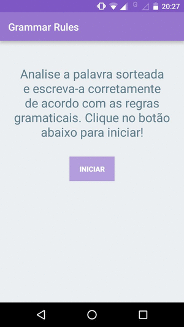

# [ Grammar Rules ]

Application to help children to learn the grammar rules. The APP will show you a random word, you need to write in the correct form to gain points.

# Instructions for how to setup the Android project and run the app:

1- Copy the github link;  
2- Open the Android Studio; 
3- Select 'Checkout project from version control'; 
4- Select 'github'; 
5- Paste the url; 
6- Select the directory that you will save the project; 
7- Click on 'clone'; 
8- A window appears asking if you want to open the project now, press 'Yes'; 
9- Connect the usb cable from your smatphone to your computer; 
10- Make sure that the developer mode is enabled and USB debuging active on your device; 
11- Press shift+f10; 
12- Select your device; 
13- Click 'Ok'. 

## Release History

* 1.0.0 First version
